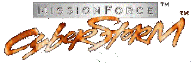

<p align="center">
  
</p>

# CyberStorm Community Patch: v1.3
**Version 1.3** introduces a collection of gameplay fixes, weapon adjustments, balance corrections, visual improvements, and quality-of-life enhancements.

## Installation Methods
Two methods are available:
1. **Direct file swap**
   * Files are located in the Github **Releases** directory of this repository.
2. **Patcher application**
   * **Python:**
     ```powershell
     python CyberstormPatcher.py "C:\GOG Games\Missionforce Cyberstorm"
     ```
   * **Executable:**
     ```powershell
     C:\CyberstormPatcher.exe "C:\GOG Games\Missionforce Cyberstorm"
     ```

# Changelog (Patches / Fixes / Modifications)
1. **Update About Screen**
   Sets the About screen to show **OS build: Win11**, **Corgo.org: Sept 18 2026**, and **version 1.30A**.

2. **Remove Cyberstrom 2 Promotion**
   Skips the `SEQUEL.ART` promotion when exiting the game.

3. **Plasma Beam Uses NBW Animation and Fire Sound**
   Gives the Plasma Beam the **Neutron Beam Weapon** projectile animation and firing sound.

4. **All Weapons Damage a Hex on a Miss**
   On a miss, the weapon damages the hex where the projectile lands. This allows all weapons, not just missiles, to damage the unit on the landed hex. Extra logic is needed to prevents the game playing 'hit' SFX even on complete misses.

5. **Uncharged Weapons Don't Trigger Enemy Reaction Fire**
   Prevents the player from using an uncharged weapon to bait a Cybrid into taking opportunity fire, while also preventing multiple reaction-fire opportunities from a single attack.

6. **Corrected Image Enhancement Weight**
   Sets the mass of the targeting computer **Image Enhancement** from `0` to `270`. This places its weight above **Lock-On 1000** but below **TRUE Lock**.

7. **SE700 Laser Gatling Uses SE660 Animation**
   Changes the SE700 Laser Gatling's projectile animation to use the **SE660 Laser Cannon** visual.

8. **Modern File Dialog (Open/Save)**
   Removes the legacy dialog hook from `CWARSDLL.DLL`, allowing Windows to use the modern Explorer-style **Open/Save** file dialog instead of the old-style dialog.

# Application Methodology
When the patching process begins, the application creates an `original` folder and preserves copies of the unmodified files inside it for double safety. 

The patcher reads `patches.json` to determine which patches to apply. This allows users to have direct control over the patching process. If a modification is undesired, it can simply be removed from the JSON file without requiring any technical knowledge. If a patch fails to apply, the process is canceled, preserving the integrity of the original files.

The patcher was developed using the GOG release as the primary version, with fallback byte sequences provided for alternative releases, such as the original retail disc version. This allows the same patch definitions to support different releases of the game where the relevant data may differ slightly. Memory addresses can therefore vary between versions, while the relevant byte sequences can be used to identify the intended code or data reliably.

Some patches require multiple steps or modifications to non-contiguous memory regions. To support these more complex operations, the application can divide a single patch (goal) into multiple steps (actions).

## Deployment Options
To support long-term endurance, the project provides multiple methods for users to choose from based on their specific use case. `.py` applications require Python to be installed, while `.exe` applications may require user trust as well as approval from the browser, antivirus software, and operating system. By offering multiple options, users can select the approach that best fits their environment and requirements. 

## Github release process
The GitHub workflow named `Build_exe.yml` converts the native Python application into an executable, removing the need for users to have Python installed. Once the executable artifact is created, it is uploaded to the repository’s `releases` folder.

After both release methods (`.exe` and `.py`) have been verified to produce matching results, the release package can be constructed. The `Build_release.yml` workflow packages the release methods, `patches.json`, and the compiled outputs into a single downloadable ZIP file, which is then published in GitHub’s Releases section.
